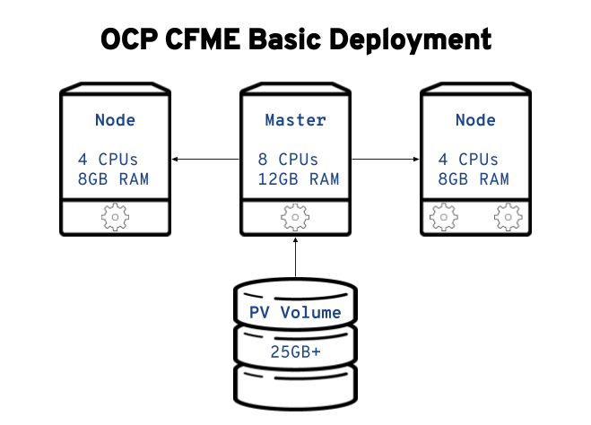

# OpenShift-Ansible - CFME Role

# PROOF OF CONCEPT - Alpha Version

This role is based on the work in the upstream
[manageiq/manageiq-pods](https://github.com/ManageIQ/manageiq-pods)
project. For additional literature on configuration specific to
ManageIQ (optional post-installation tasks), visit the project's
[upstream documentation page](http://manageiq.org/docs/get-started/basic-configuration).

Please submit a
[new issue](https://github.com/openshift/openshift-ansible/issues/new)
if you run into bugs with this role or wish to request enhancements.

# Important Notes

This is an early *proof of concept* role to install the Cloud Forms
Management Engine (ManageIQ) on OpenShift Container Platform (OCP).

* This role is still in **ALPHA STATUS**
* Many options are hard-coded still (ex: NFS setup)
* Not many configurable options yet
* **Should** be ran on a dedicated cluster
* **Will not run** on undersized infra
* The terms *CFME* and *MIQ* / *ManageIQ* are interchangeable

## Requirements

**NOTE:** These requirements are copied from the upstream
[manageiq/manageiq-pods](https://github.com/ManageIQ/manageiq-pods)
project.

### Prerequisites:

*
  [OpenShift Origin 1.5](https://docs.openshift.com/container-platform/3.5/welcome/index.html)
  or
  [higher](https://docs.openshift.com/container-platform/latest/welcome/index.html)
  provisioned
* NFS or other compatible volume provider
* A cluster-admin user (created by role if required)

### Cluster Sizing

In order to avoid random deployment failures due to resource
starvation, we recommend a minimum cluster size for a **test**
environment.

| Type           | Size    | CPUs     | Memory   |
|----------------|---------|----------|----------|
| Masters        | `1+`    | `8`      | `12GB`   |
| Nodes          | `2+`    | `4`      | `8GB`    |
| PV Storage     | `25GB`  | `N/A`    | `N/A`    |




**CFME has hard-requirements for memory. CFME will NOT install if your
  infrastructure does not meet or exceed the requirements given
  above. Do not run this playbook if you do not have the required
  memory, you will just waste your time.**


### Other sizing considerations

* Recommendations assume MIQ will be the **only application running**
  on this cluster.
* Alternatively, you can provision an infrastructure node to run
  registry/metrics/router/logging pods.
* Each MIQ application pod will consume at least `3GB` of RAM on initial
  deployment (blank deployment without providers).
* RAM consumption will ramp up higher depending on appliance use, once
  providers are added expect higher resource consumption.


### Assumptions

1) You meet/exceed the [cluster sizing](#cluster-sizing) requirements
1) Your NFS server is on your master host
1) Your PV backing storage is mounted on `/exports/`


## Role Variables

Core variables in this role:

| Name             | Default value          | Description   |
|------------------|------------------------|---------------|
| `N/A`            | `N/A`                  | `N/A`         |


Variables you may override have defaults defined in
[defaults/main.yml](defaults/main.yml).


# Usage

This section describes the basic usage of this role. All parameters
will use their [default values](defaults/main.yml).

## Pre-flight Checks

**IMPORTANT:** As documented above in [the prerequisites](#prerequisites),
  you **must already** have your OCP cluster up and running.

**Optional:** The ManageIQ pod is fairly large (about 1.7 GB) so to
save some spin-up time post-deployment, you can begin pre-pulling the
docker image now to each of your nodes now:

```
root@node0x # docker pull docker.io/manageiq/manageiq-pods:app-latest
```

## Getting Started

1) The entry point playbook to install CFME is located in
[the BYO playbooks](../../playbooks/byo/openshift-cfme/config.yml)
directory

2) Using your existing `hosts` inventory file, run `ansible-playbook`
with the entry point playbook:

```
$ ansible-playbook -v -i <INVENTORY_FILE> playbooks/byo/openshift-cfme/config.yml
```
